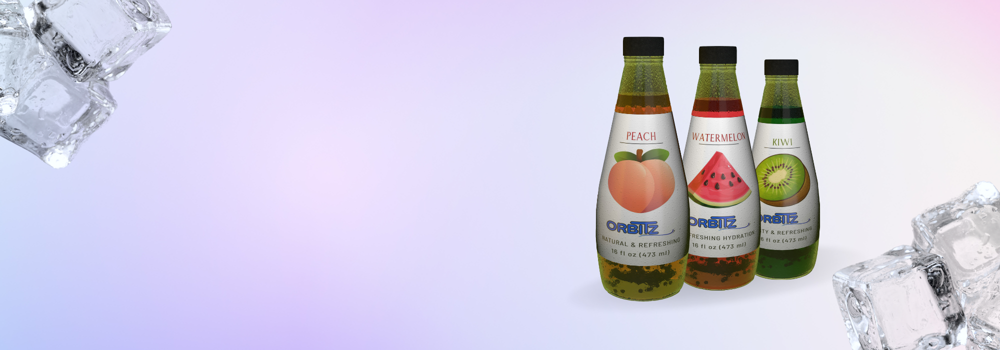

# Final Integrated Project - ORBITZ DRINK

Welcome to the Orbitz’s Website. This is a responsive platform designed to deliver a seamless experience across mobile, tablet, and desktop devices. It showcases our innovative and delicious beverages, with a focus on sustainability and flavor variety. Explore our site to learn more about our products, discover new flavors, and join us in our commitment to environmental responsibility.

## Installation

There is no installation required.

## Usage

Open index.html in the browser of your choice.

## Contributing

1. Fork it!
2. Create your feature branch: `git checkout -b my-new-feature`
3. Commit your changes: `git commit -am 'Add some feature'`
4. Push to the branch: `git push origin my-new-feature`
5. Submit a pull request :D

## History

June 18th 2024

## Credits

Thi Thanh Thuong Nguyen (Anna) and Ali El-Maniary (Leo)

## License

MIT - please see license file.